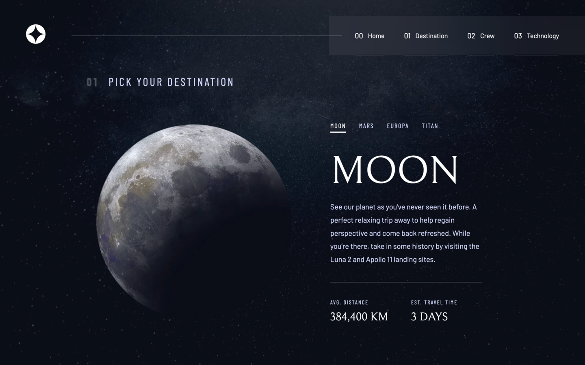

# Frontend Mentor - Space tourism website solution

This is a solution to the [Space tourism website challenge on Frontend Mentor](https://www.frontendmentor.io/challenges/space-tourism-multipage-website-gRWj1URZ3).

## Table of contents

- [Overview](#overview)
  - [The challenge](#the-challenge)
  - [Screenshot](#screenshot)
  - [Links](#links)
- [My process](#my-process)
  - [Built with](#built-with)
  - [What I learned](#what-i-learned)
  - [Continued development](#continued-development)

## Overview

### The challenge

Users should be able to:

- View the optimal layout for each of the website's pages depending on their device's screen size
- See hover states for all interactive elements on the page
- View each page and be able to toggle between the tabs to see new information

### Screenshot



### Links

- Live URL: [https://madewithbill.github.io/fm-space-tourism-website/](https://madewithbill.github.io/fm-space-tourism-website/)

## My process

### Built with

- Semantic HTML5
- SCSS/SASS
- Vanilla Javascript

### What I learned

Main thing was taking the opportunity to try out a CSS preprocessor open a larger project. I feel I picked up the essentials fairly quickly. Really liking the intuitive nesting, and bubbling media queries for readability.

```scss
img {
  width: base.rem(480);
  height: base.rem(480);
  box-sizing: content-box;
  padding: base.$spacing-300;
  @media (max-width: base.$lg) {
    width: base.rem(300);
    height: base.rem(300);
    margin: base.rem(42) auto;
    padding: 0;
  }
  @media (max-width: base.$sm) {
    width: base.rem(150);
    height: base.rem(150);
    margin: base.rem(42) auto;
    padding: 0;
  }
}
```

Also used the `transitionend` event listener to work alongside a CSS transtion in Javascript. And I learned about the ability to pass options object as an argument to an event listener. That really simplified my ability to control transitions for the mobile nav menu.

```js
document.querySelector("button.mobile-close").addEventListener("click", () => {
  document.getElementById("main-nav").classList.remove("is-open");
  document
    .getElementById("main-nav")
    .addEventListener(
      "transitionend",
      () =>
        document.getElementById("main-nav").classList.remove("nav-transition"),
      { once: true }
    );
});
```

### Continued development

I know I could be more efficient with SCSS with the use of more complex features. Particularly interested in feedback on where I’ve could’ve cut back lines of code the most.
